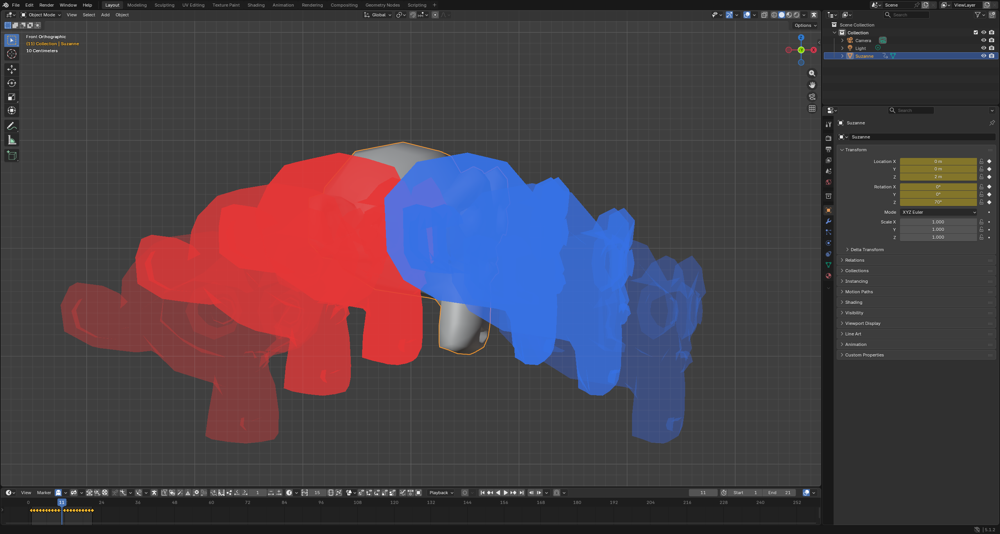
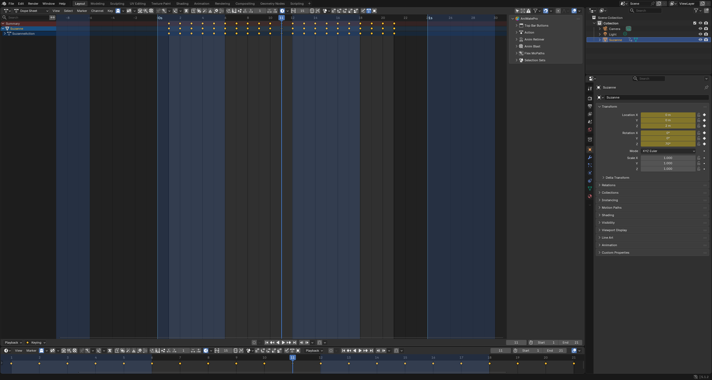

# AniMate Pro

**Supercharge your animation workflow in Blender.**

AniMate Pro (`AMP_AniMatePro`) is a large toolkit for character and motion
animators: timeline scrubbing, curve sculpting, retiming, motion paths, pose
tools, selection sets, onion skinning and dozens more, surfaced right inside the
Graph Editor, Dope Sheet, Timeline and 3D Viewport.




> GPU onion skinning: ghosted copies of an animated mesh, past poses in red and
> future poses in blue, with a distance based alpha falloff.

---

## Highlights

This build targets **Blender 5.1** and adds two new tools plus a full
compatibility and stability pass.

- **Onion Skin** (Tools): GPU viewport ghosting for armatures and any animated
  object. Four modes (Snapshots, Frame Step, On Keyframes, Before/After),
  Before and After colour coding with an alpha gradient, X-Ray and Solid render
  modes, Mesh In Front, multi target support, frame range limiting, manual and
  automatic refresh.
- **Time Visualizer** (View): a GPU overlay for the Dope Sheet and Timeline that
  draws per second tick lines, alternating checker bands, frame ticks and second
  or timecode labels, so spacing is readable in real time units.
- **Blender 5.1 hardening**: a 204 item audit with 150+ safe fixes covering
  layered and slotted actions (4.4+), draw and depsgraph handler leaks, crash
  paths and dead code. See [docs/AUDIT.md](docs/AUDIT.md).



> Time Visualizer: checker bands and second lines drawn under the keyframes on
> the Dope Sheet and Timeline.

---

## Install in Blender

1. Grab the latest `AMP_AniMatePro_vX.Y.zip` from the
   [Releases](https://github.com/AdamSmasherr/Animate/releases) page (every push
   to `main` publishes a fresh, version named build). You can also build one
   locally with `python build.py`, which writes `dist/AMP_AniMatePro_vX.Y.zip`.
2. In Blender 5.1 open **Edit > Preferences > Add-ons**.
3. Click the dropdown in the top right of the Add-ons panel and choose
   **Install from Disk**, then pick the zip.
4. Enable **AniMate - AniMate Pro** in the list.

Where the tools appear:

- **Graph Editor / Dope Sheet header**: category sections (Tools, View,
  Keyframes, Selection and more), including the **Onion Skin** and
  **Time Visualizer** buttons.
- **3D Viewport sidebar** (press `N`), **Animation** tab: the **Onion Skins**
  panel.

Full usage and per feature test steps are in [docs/FEATURES.md](docs/FEATURES.md).

---

## Quick start

**Onion Skin**

1. Select an armature or animated object.
2. Open the Onion Skins panel (`N` in the viewport, Animation tab) and click `+`.
3. Pick a mode. Frame Step shows ghosts at a regular interval around the
   playhead; On Keyframes snaps them to the keys; Snapshots lets you pin exact
   frames; Before/After uses explicit offsets.
4. Open the gear on the target row for colours, alpha, render mode and Mesh In
   Front.

**Time Visualizer**

1. In the Graph Editor or Dope Sheet header, View category, click the clock
   button to toggle the overlay.
2. Use the small popover next to it for step, colours, opacity and labels.

---

## Repository structure

```
AMP_AniMatePro/            the add-on (install this)
  anim_onionskin/          Onion Skin tool
  anim_time_visualizer/    Time Visualizer tool
  ...                      every other AniMate tool
docs/
  AUDIT.md                 Blender 5.1 audit, 204 findings
  FEATURES.md              user docs for the two new tools
  TOOL_CONCEPTS.md         designs for two future flagship tools
  images/                  screenshots
archive/                   legacy migration and dev scripts (historical)
build.py                   builds a versioned, installable zip
.github/workflows/         CI that publishes a release on every push to main
```

---

## Releases and versioning

Versions follow `MAJOR.MINOR`, where `MINOR` is the repository commit count.
The GitHub Actions workflow in `.github/workflows/release.yml` runs on every
push to `main`: it computes the version, builds `AMP_AniMatePro_vMAJOR.MINOR.zip`
and publishes a new GitHub Release with that zip attached. Each push produces a
new, incrementing release rather than overwriting an existing one.

To build the same zip locally:

```
python build.py
```

---

## Documentation

- [docs/FEATURES.md](docs/FEATURES.md): Onion Skin and Time Visualizer usage,
  in Blender test steps and known limitations.
- [docs/AUDIT.md](docs/AUDIT.md): the full Blender 5.1 audit, grouped by
  priority, with the applied fixes.
- [docs/TOOL_CONCEPTS.md](docs/TOOL_CONCEPTS.md): detailed designs for two
  advanced animator tools, Whiplash and Groundwork.

---

## Credits and license

Created by NotThatNDA (Nacho de Andres). Original `anim_offset` code by Ares
Deveaux. Licensed under the **GNU GPL v3.0 or later**.
